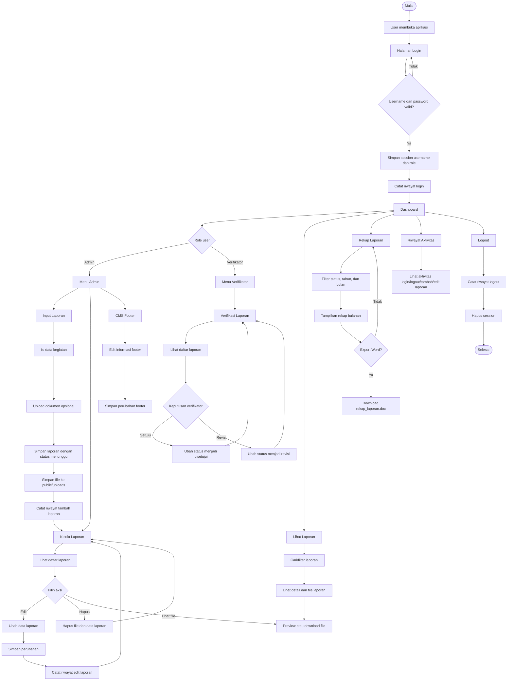
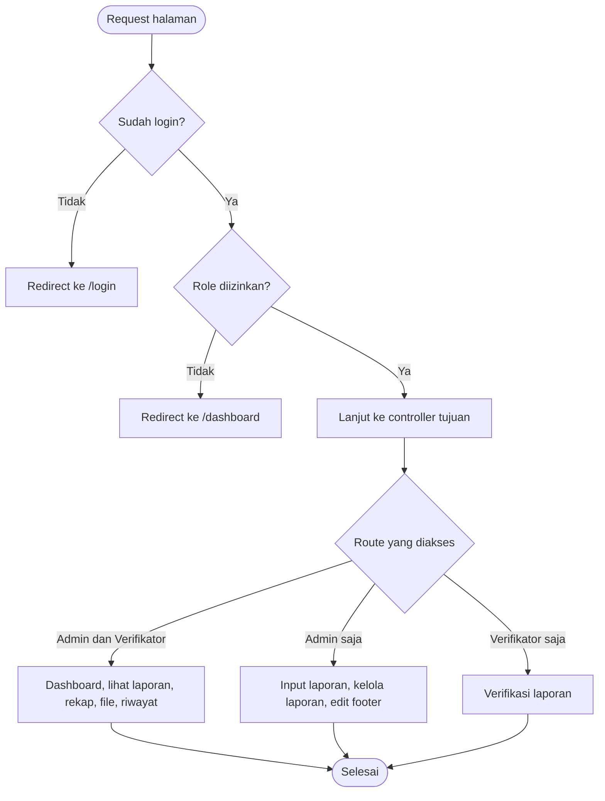
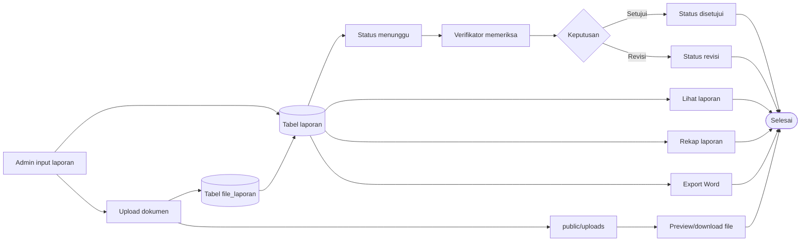
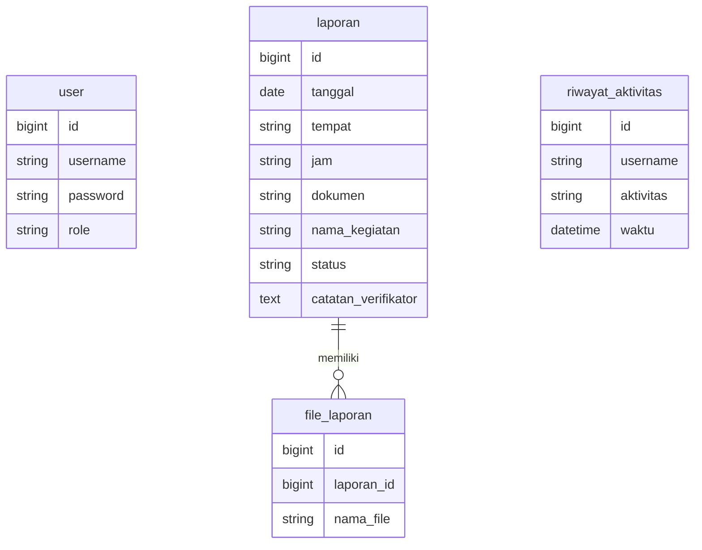

# Flowchart Proyek Laporan Kegiatan

## Alur Utama Sistem

```mermaid
flowchart TD
    A([Mulai]) --> B[User membuka aplikasi]
    B --> C[Halaman Login]
    C --> D{Username dan password valid?}
    D -- Tidak --> C
    D -- Ya --> E[Simpan session username dan role]
    E --> F[Catat riwayat login]
    F --> G[Dashboard]

    G --> H{Role user}

    H -- Admin --> I[Menu Admin]
    H -- Verifikator --> J[Menu Verifikator]

    I --> I1[Input Laporan]
    I1 --> I2[Isi data kegiatan]
    I2 --> I3[Upload dokumen opsional]
    I3 --> I4[Simpan laporan dengan status menunggu]
    I4 --> I5[Simpan file ke public/uploads]
    I5 --> I6[Catat riwayat tambah laporan]
    I6 --> K[Kelola Laporan]

    I --> K
    K --> K1[Lihat daftar laporan]
    K1 --> K2{Pilih aksi}
    K2 -- Edit --> K3[Ubah data laporan]
    K3 --> K4[Simpan perubahan]
    K4 --> K5[Catat riwayat edit laporan]
    K5 --> K
    K2 -- Hapus --> K6[Hapus file dan data laporan]
    K6 --> K
    K2 -- Lihat file --> L[Preview atau download file]

    I --> M[CMS Footer]
    M --> M1[Edit informasi footer]
    M1 --> M2[Simpan perubahan footer]

    J --> N[Verifikasi Laporan]
    N --> N1[Lihat daftar laporan]
    N1 --> N2{Keputusan verifikator}
    N2 -- Setujui --> N3[Ubah status menjadi disetujui]
    N2 -- Revisi --> N4[Ubah status menjadi revisi]
    N3 --> N
    N4 --> N

    G --> O[Lihat Laporan]
    O --> O1[Cari/filter laporan]
    O1 --> O2[Lihat detail dan file laporan]
    O2 --> L

    G --> P[Rekap Laporan]
    P --> P1[Filter status, tahun, dan bulan]
    P1 --> P2[Tampilkan rekap bulanan]
    P2 --> P3{Export Word?}
    P3 -- Ya --> P4[Download rekap_laporan.doc]
    P3 -- Tidak --> P

    G --> Q[Riwayat Aktivitas]
    Q --> Q1[Lihat aktivitas login/logout/tambah/edit laporan]

    G --> R[Logout]
    R --> S[Catat riwayat logout]
    S --> T[Hapus session]
    T --> U([Selesai])
```

## Alur Login dan Hak Akses

```mermaid
flowchart TD
    A([Request halaman]) --> B{Sudah login?}
    B -- Tidak --> C[Redirect ke /login]
    B -- Ya --> D{Role diizinkan?}
    D -- Tidak --> E[Redirect ke /dashboard]
    D -- Ya --> F[Lanjut ke controller tujuan]

    F --> G{Route yang diakses}
    G -- Admin dan Verifikator --> H[Dashboard, lihat laporan, rekap, file, riwayat]
    G -- Admin saja --> I[Input laporan, kelola laporan, edit footer]
    G -- Verifikator saja --> J[Verifikasi laporan]

    H --> K([Selesai])
    I --> K
    J --> K
```

## Alur Data Laporan

```mermaid
flowchart LR
    A[Admin input laporan] --> B[(Tabel laporan)]
    A --> C[Upload dokumen]
    C --> D[public/uploads]
    C --> E[(Tabel file_laporan)]
    E --> B

    B --> F[Status menunggu]
    F --> G[Verifikator memeriksa]
    G --> H{Keputusan}
    H -- Setujui --> I[Status disetujui]
    H -- Revisi --> J[Status revisi]

    B --> K[Lihat laporan]
    B --> L[Rekap laporan]
    B --> M[Export Word]
    D --> N[Preview/download file]

    I --> O([Selesai])
    J --> O
    K --> O
    L --> O
    M --> O
    N --> O
```

## Entitas Database Utama

```mermaid
erDiagram
    user {
        bigint id
        string username
        string password
        string role
    }

    laporan {
        bigint id
        date tanggal
        string tempat
        string jam
        string dokumen
        string nama_kegiatan
        string status
        text catatan_verifikator
    }

    file_laporan {
        bigint id
        bigint laporan_id
        string nama_file
    }

    riwayat_aktivitas {
        bigint id
        string username
        string aktivitas
        datetime waktu
    }

    laporan ||--o{ file_laporan : memiliki
```
